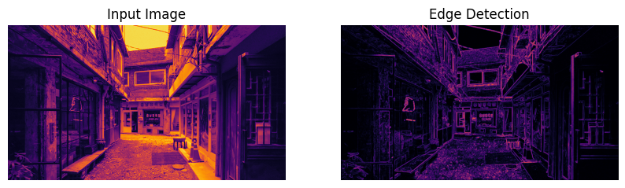

# Image_Depth
Documents of studying image depth maps.

## Table of contents
- [Environment Setting](#environment-setting)
- [History of Study](#history-of-study)
    - [Sum of Squared Differences (SSD)](#sum-of-squared-differencesssd)
    - [Binocular Disparity](#binocular-disparity)
    - [Edge Detection](#edge-detection)

## Environment Setting

### Local
Create python virtual environment and install libraries automatically:  
```bash
$ chmod +x install.sh
$ ./install.sh
```

### Docker
To run:
```
$ docker-compose up --build
```

To stop:
```
$ docker-compose down
```

## History of Study

### Sum of Squared Differences(SSD)
[The Sum of Squared Differences (SSD)](https://en.wikipedia.org/wiki/Mean_squared_error) is a commonly used metric in computer vision, particularly for tasks like stereo vision or template matching.  
It calculates the similarity between two image patches by measuring the squared differences of their pixel intensities.  
Here's a detailed breakdown of the formula you provided:  

$$
SSD(x, y, d) = \sum_{i=-\frac{B}{2}}^{\frac{B}{2}} \sum_{j=-\frac{B}{2}}^{\frac{B}{2}} \left( I_L(x + i, y + j) - I_R(x + i - d, y + j) \right)^2
$$

- **OpenCV**  


- **Numpy**  


### Binocular Disparity
[Binocular Disparity](https://en.wikipedia.org/wiki/Binocular_disparity)

### Edge Detection
This code demonstrates a basic approach to edge detection combined with multi-scale feature extraction. Below are the key steps and outputs:

#### **Multi-scale Feature Extraction**
Multi-scale feature extraction involves processing an image at different scales to capture features at various levels of detail. In this example:
- The grayscale input image is processed at scales `[1, 2, 4]`. Each scale represents a progressively smaller version of the image.
- Downsampling is used to reduce the resolution, while upsampling restores the smaller-scale images to the original size.
- All scaled images are combined by averaging, resulting in a **multi-scale feature map**.

**Output:**
- The **multi-scale feature map** retains global and local details, providing a richer representation of the input image.

#### **Edge Detection**
Edge detection is applied to the combined feature map using Sobel filters:
- **Sobel X filter** detects vertical edges by calculating horizontal intensity changes.
- **Sobel Y filter** detects horizontal edges by calculating vertical intensity changes.
- The magnitude of these gradients is computed to generate the final **depth map**.

**Output:**
- The resulting **edge-detected map** highlights edges and boundaries within the image, emphasizing depth cues.

These methods are essential for various image processing tasks, including object detection, depth estimation, and feature extraction.

- **Multi-scale**


- **Edge detection**

